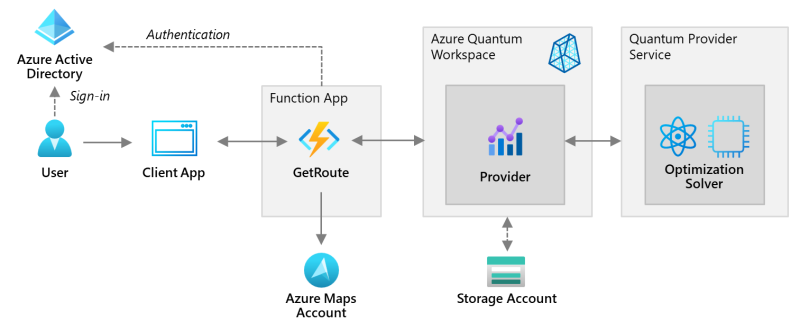

# Traveling Salesperson QIO Demo
This repo contains everything you need to show how traveling salesperson problems can be solved with Azure Quantum QIO jobs via an integrated solution that also involves Azure Maps service. Jobs can be submitted by uploading JSON-files to blob storage.



## Getting Started

### Create a fork of this repository

Click on the **Fork** button in the upper right corner of this page.


You'll get asked for an organization to fork this repo to. Select your organization.

### Create Azure Credentials

Follow instructions on [Deploy ARM templates by using GitHub Actions](https://docs.microsoft.com/azure/azure-resource-manager/templates/deploy-github-actions) for creating deployment credentials for GitHub. This includes creating a service principal and assigning **Contributor**-role to the principal.

### Configure Actions secrets

Configure two Actions secrets:

- **AZURE_CREDENTIALS** with the output generated during the service principal creation.
- **AZURE_SUBSCRIPTION** with the Azure subscription ID.

### Change the workflows (if needed)

You might want to change following settings in the **[CD-Full-Deployment.yml](.github/workflows/CD-Full-Deployment.yml)**-file:

- **AZURE_RESOURCE_GROUP_NAME** - the resource group the deployment should be targeted to
- **AZURE_RESOURCE_GROUP_LOCATION** - the region of all deployment artifacts (including the resource group)
- **AZURE_FUNCTIONAPP_NAME** - name of the application (names of other resources will be derived from)

Commit your changes. This will trigger the GitHub action that creates a resource group and deploys the application. The whole process takes a few minutes (when triggered on an empty subscription).

### Call the function

After the deployment is complete, you can call the Function via following URL:

```AzureCli
https://<AZURE_FUNCTIONAPP_NAME>.azurewebsites.net/api/GetRoute
```

In the request body provide a JSON-file with addresses of the desired destinations similar to the following (containing the addresses of German Microsoft regional offices):

```json
{
    "problem": {
        "type": "travelingsalesperson",
        "optimizeBy": "travelTimeInSeconds",
        "data": {
            "destinations": [
                "Walter-Gropius-Straße 5, 80807 München",
                "Meitnerstraße 9, 70563 Stuttgart",
                "Holzmarkt 2a, 50676 Köln",
                "Axel-Springer-Platz 3, 20355 Hamburg",
                "Friedrich-Ebert-Anlage 49, 60308 Frankfurt",
                "Unter den Linden 17, 10117 Berlin",
                "Altrottstraße 31, 69190 Walldorf"
            ]
        }
    } 
}
```

Note that you can specify via the ```optimizeBy```-parameter, whether you want to optimize by travel time (value: ```travelTimeInSeconds```) or travel distance (```lengthInMeters```).

As result you'll receive a JSON-response with an ordered list of travel points, similar to the following:

```json
{
  "result": {
    "Route": {
      "0": "Walter-Gropius-Straße 5, 80807 München",
      "1": "Meitnerstraße 9, 70563 Stuttgart",
      "2": "Altrottstraße 31, 69190 Walldorf",
      "3": "Friedrich-Ebert-Anlage 49, 60308 Frankfurt",
      "4": "Holzmarkt 2a, 50676 Köln",
      "5": "Axel-Springer-Platz 3, 20355 Hamburg",
      "6": "Unter den Linden 17, 10117 Berlin",
      "7": "Walter-Gropius-Straße 5, 80807 München"
    },
    "RouteCost": {
      "Cost": 62563.0
    }
  }
}
```

### Clean up resources

```AzureCli
    az group delete --name myResourceGroup
```